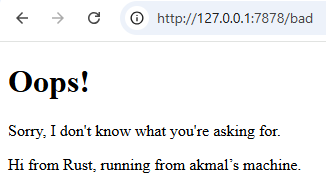

<h1>Module 6 Reflection</h1>

<h2>
Nama  : Muhammad Akmal Abdul Halim

NPM   : 2306245125

Kelas : B

</h2>

## Commit 1 : Handle-Connection Response

Pada tahap ini, kita telah mengembangkan fungsi bernama handle_connection untuk menangani koneksi yang datang dari browser. Fungsi ini menerima koneksi berupa TcpStream, yang diperoleh dari TcpListener. Setiap kali koneksi diterima, kita menggunakan BufReader untuk membaca request HTTP secara berurutan baris demi baris. Pembacaan ini dilanjutkan sampai ditemukan baris kosong, yang menandakan akhir dari header request. Setelah itu, request yang diterima disimpan dalam sebuah vektor yang berisi baris-baris string, kemudian ditampilkan di konsol. Dengan demikian, saat ini kita sudah dapat menerima request dari browser dan menampilkannya di konsol, tetapi belum dapat memberikan respons kembali kepada browser.

## Commit 2 : Returning HTML

Fungsi handle_connection pada kode ini berfungsi untuk menangani koneksi yang diterima dari klien, seperti browser, melalui objek TcpStream. Fungsi ini membaca permintaan HTTP yang masuk melalui stream menggunakan BufReader dan mengumpulkan baris-baris permintaan sampai ditemukan baris kosong, yang menandakan akhir dari header permintaan. Setelah itu, fungsi ini menyiapkan respons HTTP dengan status "200 OK" dan membaca isi file hello.html. Panjang konten tersebut dihitung dan ditambahkan ke dalam header Content-Length. Respons yang lengkap kemudian diformat dan dikirim kembali ke klien melalui stream, sehingga klien menerima respons berisi konten dari file hello.html.

```rust
    let status_line = "HTTP/1.1 200 OK";
    let contents = fs::read_to_string("hello.html").unwrap();
    let length = contents.len();
    let response = format!("{status_line}\r\nContent-Length:{length}\r\n\r\n{contents}");
    
    stream.write_all(response.as_bytes()).unwrap();
```


## Commit 3 : Validating request and selectively respondingeturning HTML

```rust
fn handle_connection(mut stream: TcpStream) {
    let buf_reader = BufReader::new(&stream);
    let request_line = buf_reader.lines().next().unwrap().unwrap();

    if request_line == "GET / HTTP/1.1" {
        let status_line = "HTTP/1.1 200 OK";
        let contents = fs::read_to_string("hello.html").unwrap();
        let length = contents.len();

        let response = format!(
            "{status_line}\r\nContent-Length: {length}\r\n\r\n{contents}"
        );

        stream.write_all(response.as_bytes()).unwrap();
    } else {
        let status_line = "HTTP/1.1 404 NOT FOUND";
        let contents = fs::read_to_string("404.html").unwrap();
        let length = contents.len();

        let response = format!(
            "{status_line}\r\nContent-Length: {length}\r\n\r\n{contents}"
        );

        stream.write_all(response.as_bytes()).unwrap();
    }
}
```

Fungsi diatas membaca baris pertama dari permintaan HTTP yang diterima dan memeriksa apakah permintaan tersebut adalah "GET / HTTP/1.1". Jika ya, status respons yang dikirimkan adalah "200 OK" dengan konten dari file hello.html, jika tidak, respons berstatus "404 NOT FOUND" dengan konten dari file 404.html. Setelah menentukan status dan file yang akan dikirim, fungsi ini membaca isi file yang relevan, menghitung panjang konten, dan membentuk respons HTTP yang berisi status, header Content-Length, dan isi file. Akhirnya, respons tersebut dikirimkan kembali ke klien melalui stream.



## Commit 4 :  Simulation of slow request.

```rust
    let (status_line, filename) = match &request_line[..] {
        "GET / HTTP/1.1" => ("HTTP/1.1 200 OK", "hello.html"), 
        "GET /sleep HTTP/1.1" => {
        thread::sleep(Duration::from_secs(10)); 
        ("HTTP/1.1 200 OK", "hello.html") 
        }
        _ => ("HTTP/1.1 404 NOT FOUND", "404.html"),
    };
```

Perubahan dalam potongan kode di atas menggantikan kondisi if-else dengan match, yang memungkinkan penanganan beberapa kondisi secara lebih terstruktur. Jika baris permintaan HTTP (request_line) adalah "GET / HTTP/1.1", maka status respons yang dikirimkan adalah "200 OK" dan file yang dibaca adalah hello.html, sama seperti sebelumnya. Namun, jika permintaan adalah "GET /sleep HTTP/1.1", program akan menunda eksekusi selama 10 detik menggunakan thread::sleep sebelum mengirimkan respons "200 OK" dengan file hello.html. Untuk permintaan lainnya, respons yang dikirimkan adalah "404 NOT FOUND" dengan file 404.html. Perubahan ini memberikan penanganan khusus untuk permintaan yang mengakses endpoint /sleep, memberikan delay sebelum mengirimkan respons.


## Commit 5 :  Multithreaded server using Threadpool

```rust
use std::{
    sync::{mpsc, Arc, Mutex},
    thread,
};

pub struct ThreadPool {
    workers: Vec<Worker>,
    sender: mpsc::Sender<Job>,
}

type Job = Box<dyn FnOnce() + Send + 'static>;

impl ThreadPool {
    pub fn new(size: usize) -> ThreadPool {
        assert!(size > 0);
        let (sender, receiver) = mpsc::channel();
        let receiver = Arc::new(Mutex::new(receiver));
        let mut workers = Vec::with_capacity(size);
        for id in 0..size {
            workers.push(Worker::new(id, Arc::clone(&receiver)));
        }
        ThreadPool { workers, sender }
    }

    pub fn execute<F>(&self, f: F)
    where
        F: FnOnce() + Send + 'static,
    {
        let job = Box::new(f);
        self.sender.send(job).unwrap();
    }
}

struct Worker {
    id: usize,
    thread: thread::JoinHandle<()>,
}

impl Worker {
    fn new(id: usize, receiver: Arc<Mutex<mpsc::Receiver<Job>>>) -> Worker {
        let thread = thread::spawn(move || loop {
            let job = receiver.lock().unwrap().recv().unwrap();
            println!("Worker {id} got a job; executing.");
            job();
        });

        Worker { id, thread }
    }
}
```

ThreadPool merupakan kumpulan thread yang sudah dibuat sebelumnya dan siap mengeksekusi tugas secara paralel. Dalam kode di atas, setiap koneksi masuk dari klien dikemas sebagai sebuah tugas (job) yang dikirim melalui channel ke ThreadPool. Setiap worker di dalam pool terus-menerus mengambil tugas dari channel dan menjalankannya. Pendekatan ini menghindari overhead pembuatan thread baru untuk setiap koneksi, sehingga memungkinkan server menangani beberapa koneksi secara bersamaan dengan lebih efisien dan optimal dalam penggunaan sumber daya.

implementasi pada main.rs

```rust
fn main() {
    let listener = TcpListener::bind("127.0.0.1:7878").unwrap();
    let pool = ThreadPool::new(4);
    for stream in listener.incoming() {
        let stream = stream.unwrap();
        pool.execute(|| {
            handle_connection(stream);
        }); 
    }
}
```