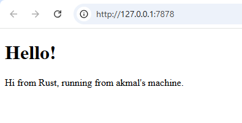

<h1>Module 6 Reflection</h1>

<h2>
Nama  : Muhammad Akmal Abdul Halim

NPM   : 2306245125

Kelas : B

</h2>

## Commit 1 : Handle-Connection Response

Pada tahap ini, kita telah mengembangkan fungsi bernama handle_connection untuk menangani koneksi yang datang dari browser. Fungsi ini menerima koneksi berupa TcpStream, yang diperoleh dari TcpListener. Setiap kali koneksi diterima, kita menggunakan BufReader untuk membaca request HTTP secara berurutan baris demi baris. Pembacaan ini dilanjutkan sampai ditemukan baris kosong, yang menandakan akhir dari header request. Setelah itu, request yang diterima disimpan dalam sebuah vektor yang berisi baris-baris string, kemudian ditampilkan di konsol. Dengan demikian, saat ini kita sudah dapat menerima request dari browser dan menampilkannya di konsol, tetapi belum dapat memberikan respons kembali kepada browser.

## Commit 2 : Returning HTML

Fungsi handle_connection pada kode ini berfungsi untuk menangani koneksi yang diterima dari klien, seperti browser, melalui objek TcpStream. Fungsi ini membaca permintaan HTTP yang masuk melalui stream menggunakan BufReader dan mengumpulkan baris-baris permintaan sampai ditemukan baris kosong, yang menandakan akhir dari header permintaan. Setelah itu, fungsi ini menyiapkan respons HTTP dengan status "200 OK" dan membaca isi file hello.html. Panjang konten tersebut dihitung dan ditambahkan ke dalam header Content-Length. Respons yang lengkap kemudian diformat dan dikirim kembali ke klien melalui stream, sehingga klien menerima respons berisi konten dari file hello.html.

